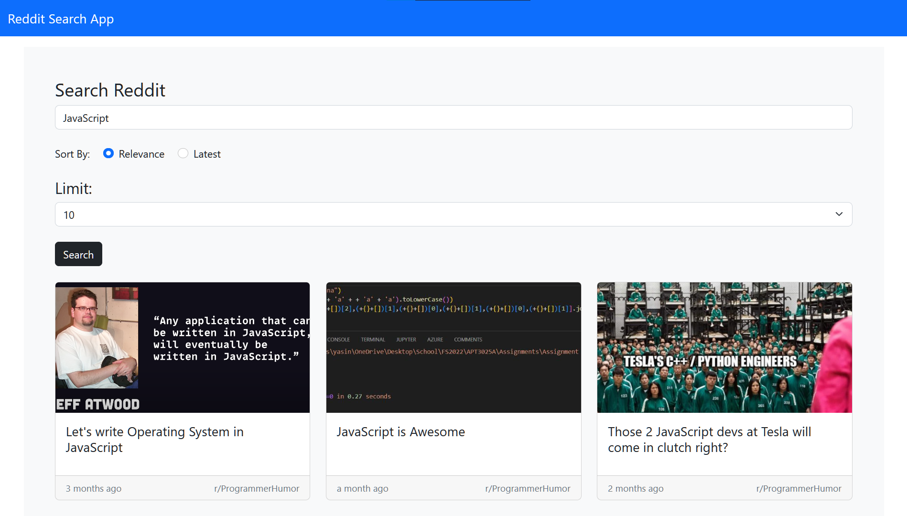

# Reddit Search App

> A Reddit post search app built using JavaScript, HTML, Bootstrap, and Parcel



## Quick Start

```bash
# Install packages
npm install

# Serve app
npm start

# Build app
npm run build
```

## Credits

Inspired by [Traversy Media - Finddit](https://github.com/bradtraversy/finddit)

## License

This project is licensed under the MIT license.
